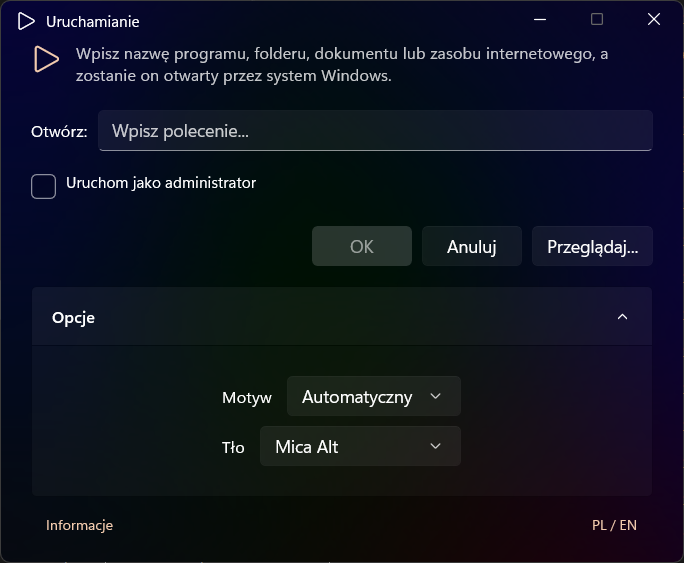

# RunDialog

A modern replacement for the classic Windows Run dialog (Win+R), built with WinUI 3 and the Windows App SDK.

## Overview

RunDialog is a lightweight, polished desktop application that lets you quickly launch programs, open files, and execute commands with features like history, administrator mode, and customizable themes.

## Features

- **Command History** – Quickly recall and re-run previous commands.
- **Run as Administrator** – Elevate privileges directly from the dialog.
- **Localization** – Supports Polish and English (extensible for more languages).
- **Themes & Backdrops** – Choose between Mica, Acrylic, and other modern backdrops.
- **File Browse Picker** – Easily locate executables or documents via a native file picker.
- **Dynamic Window Sizing** – Adaptive layout for a clean user experience.
- **Custom Title Bar** – Seamless, modern window chrome.
- **Clean Architecture** – Separated concerns with strategy patterns for command parsing and execution.

## Screenshots



## Requirements

- Windows 10, version 19041 (20H1) or later
- [.NET 10 SDK](https://dotnet.microsoft.com/download/dotnet/10.0)
- [Windows App SDK](https://learn.microsoft.com/windows/apps/windows-app-sdk/)

## Build & Run

```bash
# Build the solution
dotnet build

# Run tests
dotnet test
```

## Architecture

The solution is organized into three main layers:

- **RunDialog.Core** – Business logic, command parsing (`CommandParser`), execution strategies (`IExecutionStrategy`), and shared abstractions.
- **RunDialog.App** – WinUI 3 front-end, views, view models, dependency injection setup, and application packaging.
- **RunDialog.Tests** – Unit and integration tests using MSTest and Moq.

Execution follows the **Strategy pattern**: a `CommandExecutor` delegates to registered `IExecutionStrategy` implementations, making it easy to extend support for new command types (e.g., URLs, shell commands, or custom protocols).

## License

RunDialog is licensed under the [MIT License](LICENSE.md).

## Contributing

Contributions are welcome! Please open an issue or submit a pull request.
